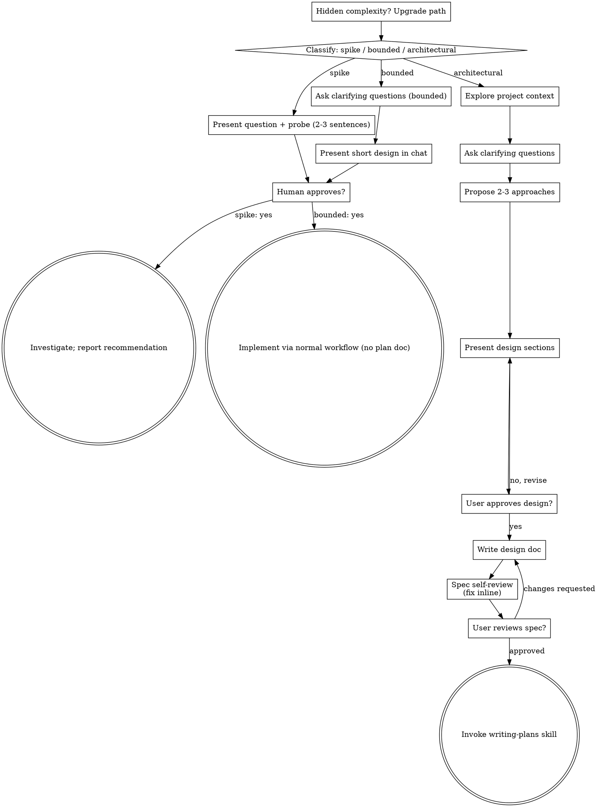

# Process Flow

Graphviz (dot) rendering of the brainstorming decision flow. Read this when the textual checklist is ambiguous about which step comes next on your path.

```dot
digraph brainstorming {
    "Classify: spike / bounded / architectural" [shape=diamond];
    "Present question + probe (2-3 sentences)" [shape=box];
    "Ask clarifying questions (bounded)" [shape=box];
    "Present short design in chat" [shape=box];
    "Human approves?" [shape=box];
    "Investigate; report recommendation" [shape=doublecircle];
    "Implement via normal workflow (no plan doc)" [shape=doublecircle];
    "Explore project context" [shape=box];
    "Ask clarifying questions" [shape=box];
    "Propose 2-3 approaches" [shape=box];
    "Present design sections" [shape=box];
    "User approves design?" [shape=box];
    "Write design doc" [shape=box];
    "Spec self-review\n(fix inline)" [shape=box];
    "User reviews spec?" [shape=box];
    "Invoke writing-plans skill" [shape=doublecircle];
    "Hidden complexity? Upgrade path" [shape=box];

    "Classify: spike / bounded / architectural" -> "Present question + probe (2-3 sentences)" [label="spike"];
    "Classify: spike / bounded / architectural" -> "Ask clarifying questions (bounded)" [label="bounded"];
    "Classify: spike / bounded / architectural" -> "Explore project context" [label="architectural"];
    "Present question + probe (2-3 sentences)" -> "Human approves?";
    "Ask clarifying questions (bounded)" -> "Present short design in chat";
    "Present short design in chat" -> "Human approves?";
    "Human approves?" -> "Investigate; report recommendation" [label="spike: yes"];
    "Human approves?" -> "Implement via normal workflow (no plan doc)" [label="bounded: yes"];
    "Hidden complexity? Upgrade path" -> "Classify: spike / bounded / architectural";
    "Explore project context" -> "Ask clarifying questions";
    "Ask clarifying questions" -> "Propose 2-3 approaches";
    "Propose 2-3 approaches" -> "Present design sections";
    "Present design sections" -> "User approves design?";
    "User approves design?" -> "Present design sections" [label="no, revise"];
    "User approves design?" -> "Write design doc" [label="yes"];
    "Write design doc" -> "Spec self-review\n(fix inline)";
    "Spec self-review\n(fix inline)" -> "User reviews spec?";
    "User reviews spec?" -> "Write design doc" [label="changes requested"];
    "User reviews spec?" -> "Invoke writing-plans skill" [label="approved"];
}
```
